<h3 align="center">


<a href="https://github.com/Eplankton/mos-stm32/stargazers"></a>
<a href="https://github.com/Eplankton/mos-stm32/network/members"></a>
<a href="https://github.com/Eplankton/mos-stm32/contributors"></a>
<a href="https://github.com/Eplankton/mos-renode/commits"></a>

[**English**](https://github.com/Eplankton/mos-renode) | [中文](https://gitee.com/Eplankton/mos-renode)

</h3>

## About 🚀

- **MOS** is a Real-Time Operating System (RTOS) project built in C++, which consists of a preemptive kernel and a command-line shell with other applications (e.g., **GuiLite** and **FatFS**).

- [**Renode**](https://renode.io/) was created by [**Antmicro**](https://antmicro.com/) as a virtual development tool for multi-node embedded networks (both wired and wireless) and is intended to enable a scalable workflow for creating effective, tested and secure IoT systems.


## Repository 🌏
- `mos-core` - The kernel and the shell, check **[here](https://github.com/Eplankton/mos-core)**.
- `mos-stm32` - Running on STM32 series, check **[here](https://github.com/Eplankton/mos-stm32)**.
- `mos-renode` - Testing on Renode emulation, check **[here](https://github.com/Eplankton/mos-renode)**.

## Start 📦

- ### Use CMake
  - Install the **CMake** and the `arm-none-eabi-gcc` toolchain, then open `*.code-workspace` using `VS Code`.
  - Run `./build.sh` to call **CMake Tools** and build the project.

- ### Use EIDE
  - Run `git submodule init && git submodule update` to pull the submodule `core`.
  - Install **[EIDE](https://em-ide.com)** extension and the `arm-none-eabi-gcc` toolchain, then open `*.code-workspace` using `VS Code`.

- ### Renode Emulation
  - Install the **[Renode](https://github.com/renode/renode?tab=readme-ov-file#installation)** platform, and add `renode` to the `/usr/bin` path or environment variables.
  - Run `Start Debugging` or press `F5` to start, open a `TCP` connection on `localhost:3333`, and observe the serial output.


## Manual 📚

-  [Manual(English) from **DeepWiki**](https://deepwiki.com/Eplankton/mos-renode) | [**用户手册(中文)**](manual_zh.pdf)

## Architecture 🔍


```
.
├── 📁 emulation             // Renode emulation script
├── 📁 vendor                // Vendor HALs
├── 📁 core
│   ├── 📁 external          // External Library
│   ├── 📁 arch              // Architecture-Specific Code
│   │   └── cpu.hpp          // Initialization/Context Switch assembly code
│   │
│   ├── 📁 kernel            // Kernel Layer
│   │   ├── macro.hpp        // Kernel Constants Macro
│   │   ├── type.hpp         // Basic Types
│   │   ├── concepts.hpp     // Type Constraints
│   │   ├── data_type.hpp    // Basic Data Structures
│   │   ├── alloc.hpp        // Memory Management
│   │   ├── global.hpp       // Kernel Global Variables
│   │   ├── printf.h/.c      // Thread-Safe printf
│   │   ├── task.hpp         // Task Management
│   │   ├── sync.hpp         // Synchronization Primitives
│   │   ├── async.hpp        // Asynchronous Stackless Coroutines
│   │   ├── scheduler.hpp    // Scheduler
│   │   ├── ipc.hpp          // Inter-Process Communication
│   │   └── utils.hpp        // Other Utilities
│   │
│   ├── config.h             // System Configuration
│   ├── kernel.hpp           // Kernel Modules
│   └── shell.hpp            // Shell Command Line
│
└── 📁 app                   // User Code
    ├── main.cpp             // Entry Function
    └── test.hpp             // Test Code
```

## Example 🍎
`Shell Test`
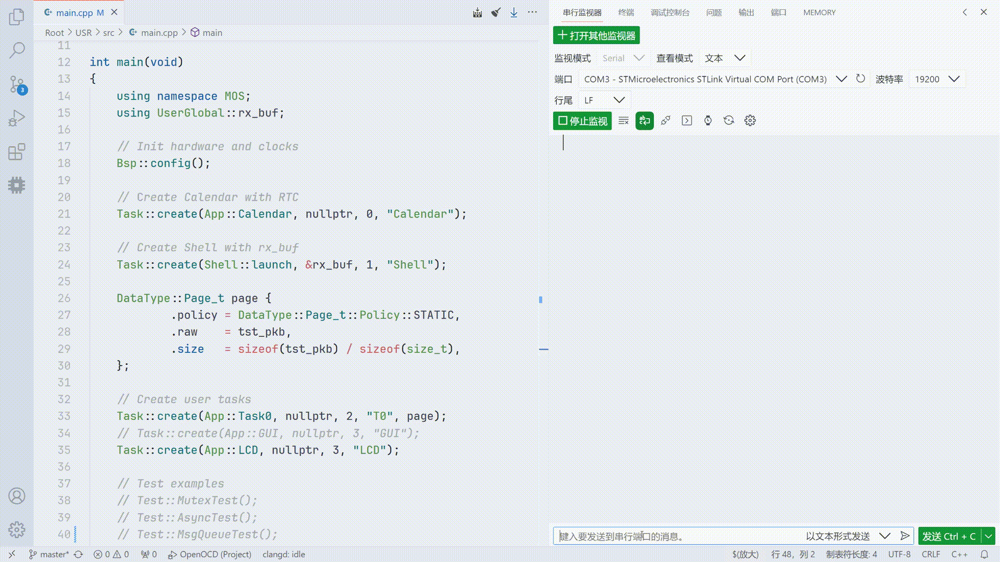

`Mutex Test(Priority Ceiling Protocol)`
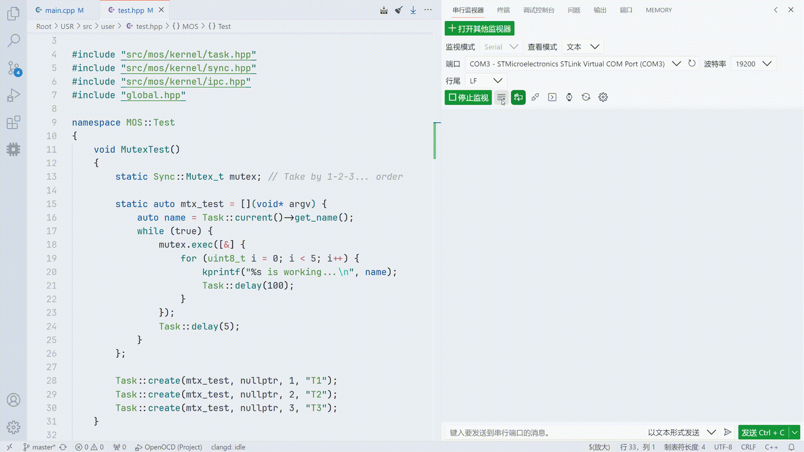

`LCD Driver & GUI Demo`<br>
<p align="center">
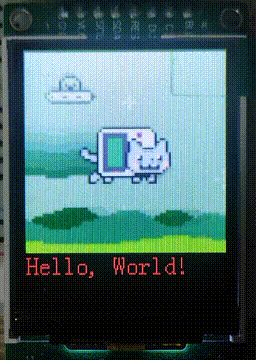 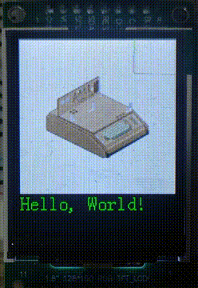 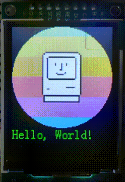
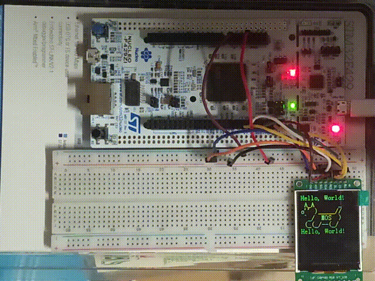 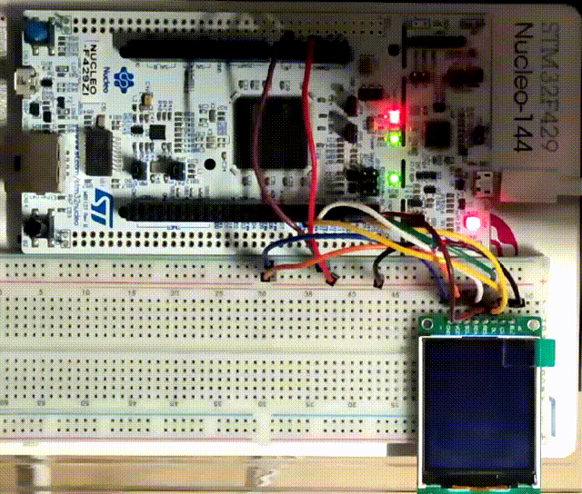
</p>

`Concurrent Task Period & Time Sequence`<br>
<p align="center">
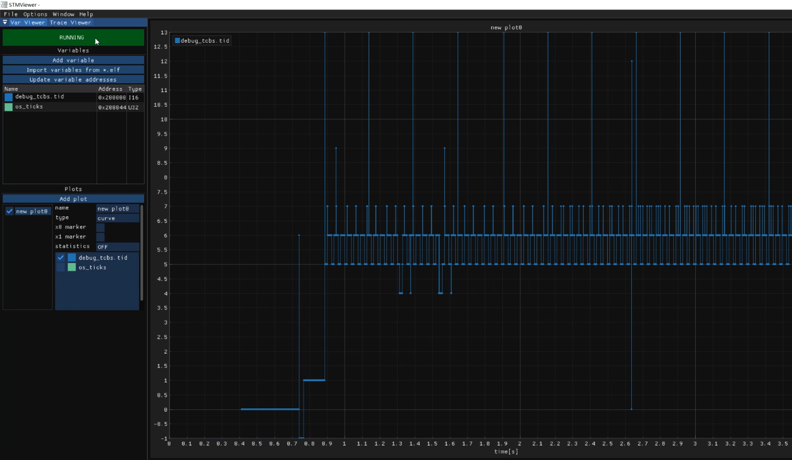
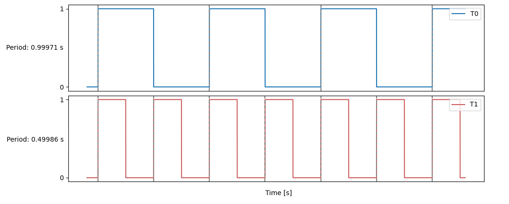
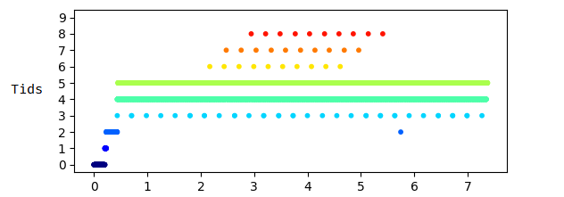
</p>

```C++
// MOS Kernel & Shell
#include "mos/kernel.hpp"
#include "mos/shell.hpp"

// HAL and Device 
#include "drivers/stm32f4xx/hal.hpp"
#include "drivers/device/led.hpp"
```
```C++
namespace MOS::User::Global
{
    using namespace HAL::STM32F4xx;
    using namespace Driver::Device;
    using namespace DataType::SyncUartDev_t;

    // Shell I/O UART and Buffer
    auto stdio = SyncUartDev_t<32> {USARTx};

    // LED red, green, blue
    Device::LED_t leds[] = {...};
}
```
```C++
namespace MOS::User::BSP
{
    using namespace Driver;
    using namespace Global;

    void LED_Config()
    {
        for (auto& led: leds) {
            led.init();
        }
    }

    void USART_Config()
    {
        stdio.init(9600-8-1-N)
             .rx_config(PXa)  // RX -> PXa
             .tx_config(PYb)  // TX -> PYb
             .it_enable(RXNE) // Enable RXNE interrupt
             .enable();       // Enable UART
    }
    ...
}
```
```C++
namespace MOS::User::App
{
    // Blinky by Task::delay() -> Thread Model
    void red_blink(Device::LED_t leds[])
    {
        while (true) {
            leds[0].toggle(); // red
            Task::delay(500_ms);
        }
    }

    // Blinky by Async::delay() -> Coroutine Model
    Async::Future_t<void> blue_blink(Device::LED_t leds[])
    {
        while (true) {
            leds[1].toggle(); // blue
            co_await Async::delay(500_ms);
        }
    }
    ...
}
```
```C++
int main()
{
    using namespace MOS;
    using namespace Kernel;
    using namespace User::Global;

    BSP::config(); // Init periphs and clocks

    Task::create( // Create a calendar with RTC
        App::time_init, nullptr, 0, "time/init"
    );

    Task::create( // Create a shell on stdio
        Shell::launch, &stdio.buf, 1, "shell"
    );

    /* User Tasks */
    Task::create(App::red_blink, &leds, 2, "blinky");
    ...

    /* Test examples */
    Test::MutexTest();
    Test::MsgQueueTest();
    Test::AsyncTest();
    ...
    
    // Start scheduling, never return
    Scheduler::launch();
}
```

## Boot Up ⚡
```plain
 A_A       _   Version @ x.x.x(...)
o'' )_____//   Build   @ TIME, DATE
 `_/  MOS  )   Chip    @ MCU, ARCH
 (_(_/--(_/    2023-2026 Copyright by Eplankton

<Tid> <Name> <Priority> <Status> <Mem%>
---------------------------------------
 #0    idle     15       READY     10%
 #1    shell     1       BLOCKED   21%
 #2    blinky    2       RUNNING    9%
---------------------------------------
```

## RoadMap 🧾

📦 `v0.4`

> ✅ Done：
>
> - **CMake Tools** are now available for compiling the project
> - Add external library [**ETL**](https://www.etlcpp.com/), a C++ template library for embedded applications
> - Add `Renode` emulation platform, add stable support for `Cortex-M` series
> - **[Experimental]** Add scheduler lock `Scheduler::suspend()`
> - **[Experimental]** Add Asynchronous stackless coroutines `Async::{Executor, Future_t, co_await/yield/return}`
>
> 📌 Planned: 
>
> - Shift from `FatFS` to `LittleFS`

📦 `v0.3`

> ✅ Done:
>
> - Mapping `Tids` to `BitMap_t`
> - Message queue `IPC::MsgQueue_t`
> - `Task::create` allows generic function signatures as `void fn(auto argv)` with type checker
> - Added `ESP32-C3` as a `WiFi` component
> - Added `Driver::Device::SD_t`, `SD` card driver, porting `FatFs` file system
> - Added `Shell::usr_cmds` for user-registered commands
> - **[Experimental]** Atomic types `<stdatomic.h>`
> - **[Experimental]** `Utils::IrqGuard_t`, nested interrupt critical sections
> - **[Experimental]** Simple formal verification of `Scheduler + Mutex`
>
> 📌 Planned: 
>
> - Inter-Process Communication: pipes/channels
> - `FPU` hardware float support
> - Performance benchmarking
> - Error handling with `Result<T, E>`, `Option<T>`
> - `DMA_t` DMA Driver
> - Software/hardware timers `Timer`
> - **[Experimental]** Adding `POSIX` support
> - **[Experimental]** More real-time scheduling algorithms


📦 `v0.2`

> ✅ Done:
> 
> - Synchronization primitives `Sync::{Sema_t, Lock_t, Mutex_t<T>, CondVar_t, Barrier_t}`
> - `Scheduler::Policy::PreemptPri` with `RoundRobin` scheduling for same priority levels
> - `Task::terminate` implicitly called upon task exit to reclaim resources
> - Simple command-line interaction `Shell::{Command, CmdCall, launch}`
> - `HAL::STM32F4xx::SPI_t` and `Driver::Device::ST7735S_t`, porting the `GuiLite` graphics library
> - Blocking delay with `Kernel::Global::os_ticks` and `Task::delay`
> - Refactored project organization into `{kernel, arch, drivers}`
> - Support for `GCC` compilation, compatible with `STM32Cube HAL`
> - Real-time calendar `HAL::STM32F4xx::RTC_t`, `CmdCall::date_cmd`, `App::Calendar`
> - `idle` uses `Kernel::Global::zombie_list` to reclaim inactive pages
> - Three basic page allocation policies `Page_t::Policy::{POOL, DYNAMIC, STATIC}`


📦 `v0.1`

> ✅ Done:
> 
> - Basic data structures, scheduler, and task control, memory management
>
> 📌 Planned: 
> 
> - Timers, round-robin scheduling
> - Inter-Process Communication (IPC), pipes, message queues
> - Process synchronization (Sync), semaphores, mutexes
> - Design a simple Shell
> - Variable page sizes, memory allocator
> - SPI driver, porting GuiLite/LVGL graphics libraries
> - Porting to other boards/arch, e.g., ESP32-C3 (RISC-V)


## References 🛸
- [How to build a Real-Time Operating System(RTOS)](https://medium.com/@dheeptuck/building-a-real-time-operating-system-rtos-ground-up-a70640c64e93)
- [PeriodicScheduler_Semaphore](https://github.com/Dungyichao/PeriodicScheduler_Semaphore)
- [STM32F4-LCD_ST7735s](https://github.com/Dungyichao/STM32F4-LCD_ST7735s)
- [A printf/sprintf Implementation for Embedded Systems](https://github.com/mpaland/printf)
- [GuiLite](https://github.com/idea4good/GuiLite)
- [STMViewer](https://github.com/klonyyy/STMViewer)
- [FatFs](http://elm-chan.org/fsw/ff)
- [The Zephyr Project](https://www.zephyrproject.org/)
- [Eclipse ThreadX](https://github.com/eclipse-threadx/threadx)
- [Embassy](https://embassy.dev/)
- [Renode](https://renode.io/)
- [Embedded Template Library (ETL)](https://www.etlcpp.com)
---

<p align="center">
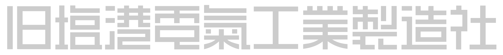

</p>

```plain
I hope the Pacific is as blue as it has been in my dreams. 
I hope.

-- Stephen King's "Rita Hayworth and the Shawshank Redemption", 1982
```