<h1 align="center">

</h1>

<h3 align="center">

<a href="https://github.com/Eplankton/mos-stm32/stargazers"></a>
<a href="https://github.com/Eplankton/mos-stm32/network/members"></a>
<a href="https://github.com/Eplankton/mos-stm32/contributors"></a>
<a href="https://github.com/Eplankton/mos-renode/commits"></a>

**[中文](https://gitee.com/Eplankton/mos-renode) | [English](https://github.com/Eplankton/mos-renode)**

</h3>

> [!NOTE]
> 本项目正在积极开发和改进中，随着设计的不断完善，一些 API 和接口可能会发生变化。

## 简介 🚀

- **MOS** 是一个用 C++/Rust 编写的实时操作系统 (Real-Time Operating System, RTOS) 项目，包含一个抢占式内核和简易命令行, 并移植了一些应用层组件 (例如：**GuiLite** 和 **FatFS** 等)。

- [**Renode**](https://renode.io/) 由 [**Antmicro**](https://antmicro.com/) 创建，是一款用于多节点嵌入式网络（有线和无线）的虚拟化平台，旨在实现可扩展的工作流程，开发有效、经过测试且安全的物联网系统。

## 仓库 🌏
- `mos-core` - 内核与简易命令行, **[链接](https://gitee.com/Eplankton/mos-core)**
- `mos-stm32` - 在 STM32 上运行, **[链接](https://gitee.com/Eplankton/mos-stm32)**
- `mos-renode` - 使用 Renode 仿真运行, **[链接](https://gitee.com/Eplankton/mos-renode)**

- `mos-rust` - Vibe Coding 出来的缝合怪, **[链接](https://gitee.com/Eplankton/mos-rust)**.

## 启动 📦

- ### 使用 CMake
  - 安装 **CMake** 和 `Arm GNU Toolchain` 工具链
  - 运行 `./build.sh`, 调用 **CMake Tools** 编译项目

- ### 使用 EIDE
  - 运行 `git submodule init && git submodule update` 拉取子模块 `core`
  - 安装 **[EIDE](https://em-ide.com)** 插件和 `Arm GNU Toolchain` 工具链, 使用 `VS Code` 打开 `*.code-workspace`

- ### Renode 仿真
  - 安装 **[Renode](https://github.com/renode/renode?tab=readme-ov-file#installation)** 仿真平台, 将 `renode` 添加到 `/usr/bin` 路径或环境变量
  - 运行 `开始调试` 或 `F5` 启动仿真, 打开 `TCP` 连接 `localhost:3333`, 观察串口输出

## 文档 📚

- **[用户手册(中文)](manual_zh.pdf) | [Manual(English) from **DeepWiki**](https://deepwiki.com/Eplankton/mos-renode)**


## 架构 🔍


```
.
├── 📁 emulation             // Renode 仿真脚本
├── 📁 vendor                // 硬件抽象层
├── 📁 core
│   ├── 📁 external          // 外部库
│   ├── 📁 arch              // 架构相关
│   │   └── cpu.hpp          // 初始化/上下文切换
│   │
│   ├── 📁 kernel            // 内核层
│   │   ├── macro.hpp        // 内核常量宏
│   │   ├── type.hpp         // 基础类型
│   │   ├── concepts.hpp     // 类型约束
│   │   ├── data_type.hpp    // 基本数据结构
│   │   ├── alloc.hpp        // 内存管理
│   │   ├── global.hpp       // 内核层全局变量
│   │   ├── printf.h/.c      // 线程安全的 printf
│   │   ├── task.hpp         // 任务控制
│   │   ├── sync.hpp         // 同步原语
│   │   ├── async.hpp        // 异步协程
│   │   ├── scheduler.hpp    // 调度器
│   │   ├── ipc.hpp          // 进程间通信
│   │   └── utils.hpp        // 其他工具
│   │
│   ├── config.h             // 系统配置
│   ├── kernel.hpp           // 内核模块
│   └── shell.hpp            // Shell 命令行
│
└── 📁 app                   // 用户层
    ├── main.cpp             // 入口函数
    └── test.hpp             // 测试代码
```

## 示例 🍎
- `Shell交互`
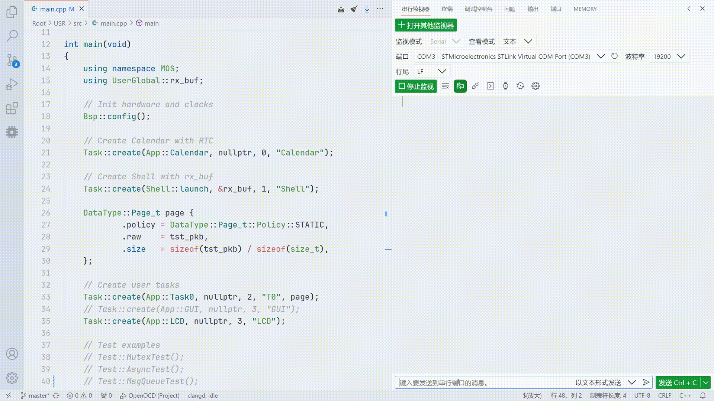

- `Mutex测试(优先级天花板协议)`
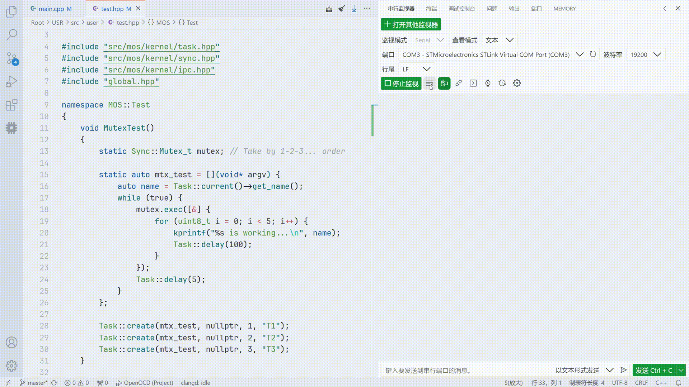

- `LCD驱动与GUI`<br>
<p align="center">
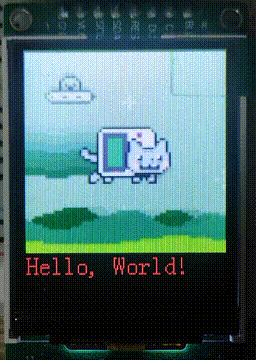 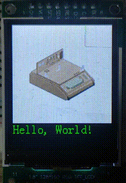 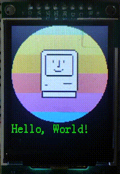
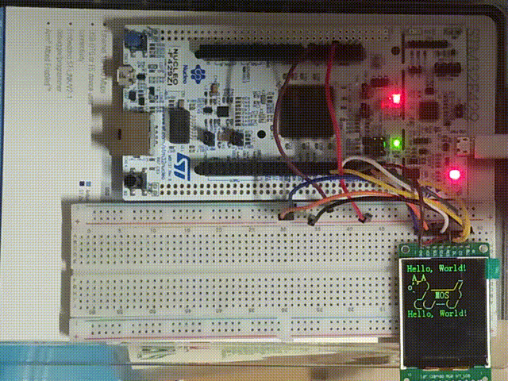 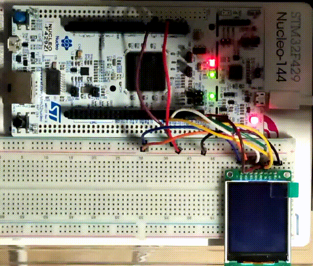
</p>

- `并发任务周期与抢占`<br>
<p align="center">
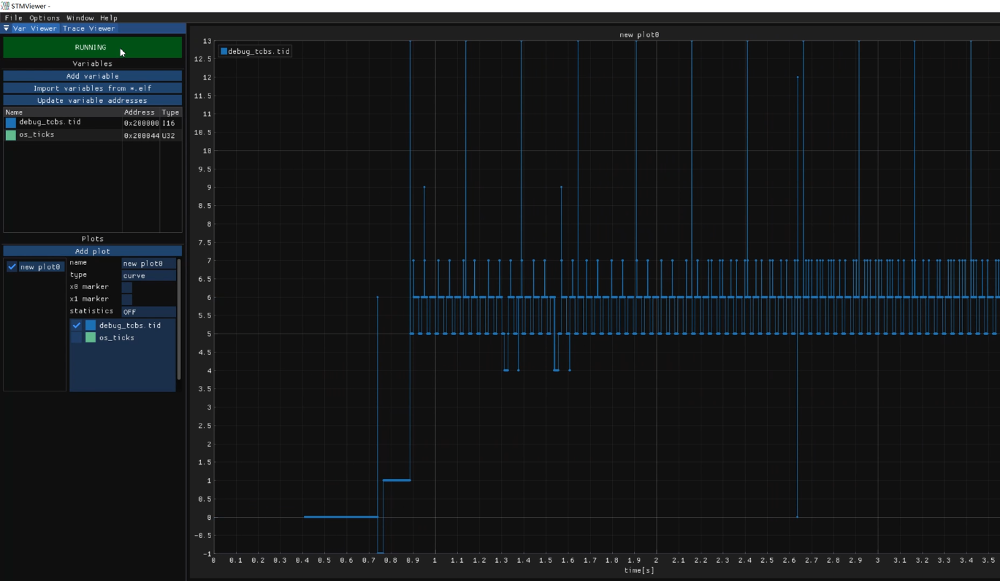
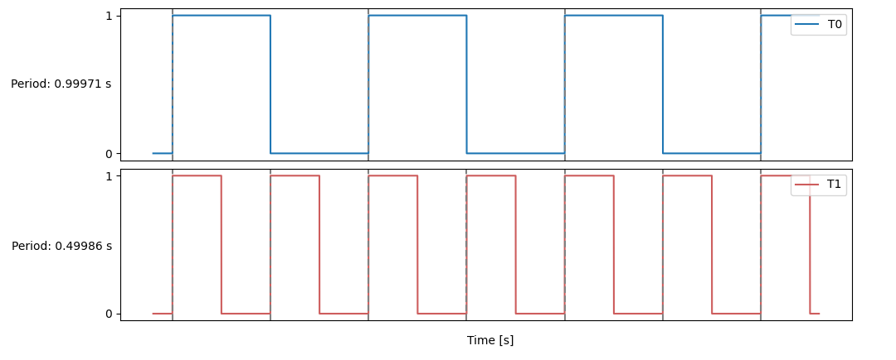
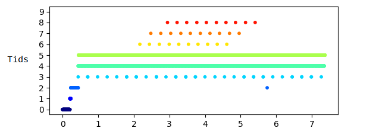
</p>

```C++
// MOS Kernel & Shell
#include "mos/kernel.hpp"
#include "mos/shell.hpp"

// HAL and Device 
#include "drivers/stm32f4xx/hal.hpp"
#include "drivers/device/led.hpp"
```
```C++
namespace MOS::User::Global
{
    using namespace HAL::STM32F4xx;
    using namespace Driver::Device;
    using namespace DataType::SyncUartDev_t;

    // Shell I/O UART and Buffer
    auto stdio = SyncUartDev_t<32> {USARTx};

    // LED red, green, blue
    Device::LED_t leds[] = {...};
}
```
```C++
namespace MOS::User::BSP
{
    using namespace Driver;
    using namespace Global;

    void LED_Config()
    {
        for (auto& led: leds) {
            led.init();
        }
    }

    void USART_Config()
    {
        stdio.init(9600-8-1-N)
             .rx_config(PXa)  // RX -> PXa
             .tx_config(PYb)  // TX -> PYb
             .it_enable(RXNE) // Enable RXNE interrupt
             .enable();       // Enable UART
    }
    ...
}
```
```C++
namespace MOS::User::App
{
    // Blinky by Task::delay() -> Thread Model
    void red_blink(Device::LED_t leds[])
    {
        while (true) {
            leds[0].toggle(); // red
            Task::delay(500_ms);
        }
    }

    // Blinky by Async::delay() -> Coroutine Model
    Async::Future_t<void> blue_blink(Device::LED_t leds[])
    {
        while (true) {
            leds[1].toggle(); // blue
            co_await Async::delay(500_ms);
        }
    }
    ...
}
```
```C++
int main()
{
    using namespace MOS;
    using namespace Kernel;
    using namespace User::Global;

    BSP::config(); // Init periphs and clocks

    Task::create( // Create a calendar with RTC
        App::time_init, nullptr, 0, "time/init"
    );

    Task::create( // Create a shell on stdio
        Shell::launch, &stdio.buf, 1, "shell"
    );

    /* User Tasks */
    Task::create(App::red_blink, &leds, 2, "blinky");
    ...

    /* Test examples */
    Test::MutexTest();
    Test::MsgQueueTest();
    Test::AsyncTest();
    ...
    
	// Launch Scheduler, never return
    Scheduler::launch();
}
```

## 启动 ⚡
```plain
 A_A       _   [name]  @ x.x.x(Version)
o'' )_____//   Build   @ TIME, DATE
 `_/  MOS  )   Chip    @ MCU, ARCH
 (_(_/--(_/    2023-2026 Copyright by Eplankton

<Tid> <Name> <Priority> <Status> <Mem%>
---------------------------------------
 #0    idle     15       READY     10%
 #1    shell     1       BLOCKED   21%
 #2    blinky    2       RUNNING    9%
---------------------------------------
```

## 里程碑 📜

📦 `v0.5`

> ✅ 完成：
> - **[实验性]** 移植到 `ESP32-C6(RISC-V)`
> - **[实验性]** 使用 `Rust` 重写

📦 `v0.4`

> ✅ 完成：
> - 添加 `FPU` 硬件浮点支持
> - 可使用 **CMake Tools** 编译项目
> - 引入嵌入式 C++ 模板库 [**ETL**](https://www.etlcpp.com/)
> - 开发平台迁移，使用 `Renode` 仿真平台, 稳定支持 `Cortex-M` 系列
> - **[实验性]** 添加调度器锁 `Scheduler::suspend()`
> - **[实验性]** 添加异步无栈(Stackless)协程 `Async::{Executor, Future_t, co_await...}`
>
> 📌 计划： 
>
> - 从 `FatFS` 迁移到 `LittleFS`


📦 `v0.3`

> ✅ 完成：
>
> - `Tids` 映射到 `BitMap_t`
> - `IPC::MsgQueue_t`，消息队列
> - `Task::create` 允许泛型函数签名为 `void fn(auto argv)`，提供类型检查
> - 添加 `ESP32-C3` 作为 `WiFi` 元件
> - 添加 `Driver::Device::SD_t`，`SD`卡驱动，移植 `FatFs` 文件系统
> - 添加 `Shell::usr_cmds`，用户注册命令
> - **[实验性]** 原子类型 `<stdatomic.h>`
> - **[实验性]** `Utils::IrqGuard_t`，嵌套中断临界区
> - **[实验性]** `Scheduler + Mutex` 简单的形式化验证
>
> 📌 计划： 
>
> - 进程间通信：管道/通道
> - 性能基准测试
> - `Result<T, E>, Option<T>`，错误处理
> - `DMA_t` 驱动
> - 软/硬件定时器 `Timer`
> - **[实验性]** 添加 `POSIX` 支持
> - **[实验性]** 更多实时调度算法


📦 `v0.2`

> ✅ 完成：
> 
> - `Sync::{Sema_t, Lock_t, Mutex_t<T>, CondVar_t, Barrier_t}` 同步原语
> - `Scheduler::Policy::PreemptPri`，在相同优先级下则以时间片轮转 `RoundRobin` 调度
> - `Task::terminate` 在任务退出时隐式调用，回收资源
> - `Shell::{Command, CmdCall, launch}`，简单的命令行交互
> - `HAL::STM32F4xx::SPI_t` 和 `Driver::Device::ST7735S_t`, 移植 `GuiLite` 图形库
> - `Kernel::Global::os_ticks` 和 `Task::delay`，阻塞延时
> - 重构项目组织为 `{kernel, arch, drivers}`
> - 支持 `GCC` 编译，兼容 `STM32Cube HAL`
> - `HAL::STM32F4xx::RTC_t`, `CmdCall::date_cmd`, `App::Calendar` 实时日历
> - `idle` 使用 `Kernel::Global::zombie_list` 回收非活动页面
> - 三种基本的页面分配策略 `Page_t::Policy::{POOL(池), DYNAMIC(动态), STATIC(静态)}`


📦 `v0.1`

> ✅ 完成：
> 
> - 基本的数据结构、调度器与任务控制、内存管理
>
> 📌 计划： 
> 
> - 定时器，时间片轮转调度
> - 进程间通信 `IPC`，管道、消息队列
> - 进程同步 `Sync`，信号量、互斥锁
> - 移植简单的 `Shell`
> - 可变页面大小，内存分配器
> - `SPI` 驱动，移植 `GuiLite/LVGL` 图形库
> - 移植到其他开发板/架构，例如 `ESP32-C3(RISC-V)`


## 参考资料 🛸
- [How to build a Real-Time Operating System(RTOS)](https://medium.com/@dheeptuck/building-a-real-time-operating-system-rtos-ground-up-a70640c64e93)
- [PeriodicScheduler_Semaphore](https://github.com/Dungyichao/PeriodicScheduler_Semaphore)
- [STM32F4-LCD_ST7735s](https://github.com/Dungyichao/STM32F4-LCD_ST7735s)
- [A printf/sprintf Implementation for Embedded Systems](https://github.com/mpaland/printf)
- [GuiLite](https://github.com/idea4good/GuiLite)
- [STMViewer](https://github.com/klonyyy/STMViewer)
- [FatFs](http://elm-chan.org/fsw/ff)
- [The Zephyr Project](https://www.zephyrproject.org/)
- [Eclipse ThreadX](https://github.com/eclipse-threadx/threadx)
- [Embassy](https://embassy.dev/)
- [Renode](https://renode.io/)
- [Embedded Template Library (ETL)](https://www.etlcpp.com)
---

<p align="center">
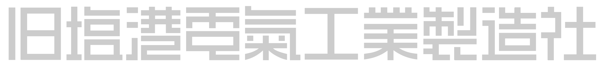

</p>

```plain
I hope the Pacific is as blue as it has been in my dreams. 
I hope.

-- Stephen King's "Rita Hayworth and the Shawshank Redemption", 1982
```